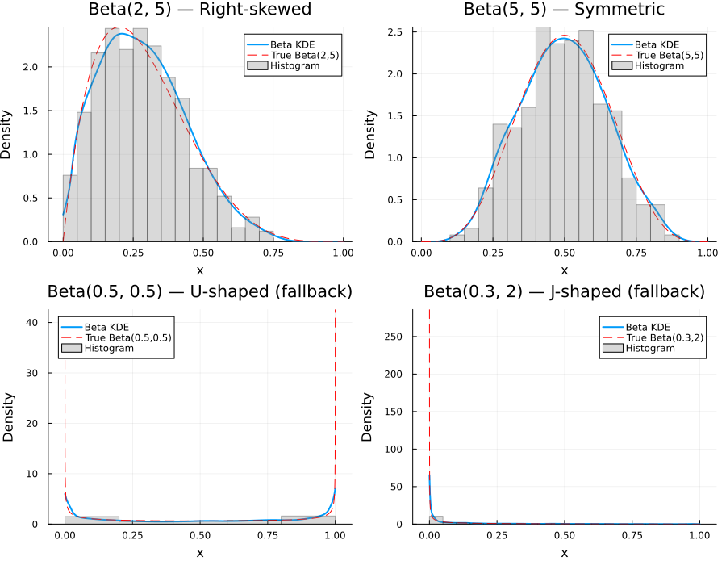
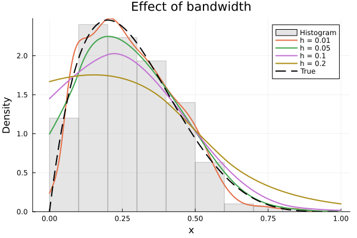

# BetaKDE.jl

[](https://github.com/egonmedhatten/BetaKDE.jl/actions/workflows/CI.yml)
[](LICENCE)

Beta kernel density estimation for data on [0, 1] with a fast, closed-form O(1) bandwidth selector.

**Paper:** Johan Hallberg Szabadváry (2026). *A Fast, Closed-Form Bandwidth Selector for the Beta Kernel Density Estimator*. Journal of Computational and Graphical Statistics. [DOI: 10.1080/10618600.2026.2670662](https://doi.org/10.1080/10618600.2026.2670662) | [arXiv preprint](https://doi.org/10.48550/arXiv.2601.19553)

## Why Beta KDE?

Standard (Gaussian) kernel density estimators suffer from boundary bias on bounded domains — they leak density outside [0, 1] and underestimate near boundaries. Beta kernels naturally respect the [0, 1] support, adapting their shape at the boundaries (Chen, 1999).

This package adds an **O(1) closed-form bandwidth selector** based on the MISE-optimal formula derived in the paper above, with an automatic fallback heuristic for challenging distributions (U-shaped, J-shaped, etc.).



## Installation

```julia
using Pkg
Pkg.add(url="https://github.com/egonmedhatten/BetaKDE.jl")
```

Once registered in the General registry:

```julia
] add BetaKDE
```

## Quick Start

```julia
using BetaKDE, Distributions

# Generate sample data on [0, 1]
data = rand(Beta(2, 5), 500)

# Estimate density (automatic bandwidth selection)
result = betakde(data)

# Access results
result.x          # evaluation grid (512 points by default)
result.density    # estimated density values
result.bandwidth  # selected bandwidth
```

### Plotting

BetaKDE provides a [Plots.jl recipe](https://docs.juliaplots.org/stable/recipes/), so you can plot directly:

```julia
using Plots
plot(result; label="Beta KDE")
```

### Options

```julia
# Custom bandwidth
result = betakde(data; bw=0.05)

# Fewer grid points
result = betakde(data; npoints=256)

# Skip normalization (raw kernel average)
result = betakde(data; normalize=false)

# Data on arbitrary [a, b] interval
data_ab = rand(100) .* 10  # data on [0, 10]
result = betakde(data_ab; lower=0.0, upper=10.0)
```

### StatsBase Integration

If [StatsBase.jl](https://github.com/JuliaStats/StatsBase.jl) is loaded, you can use the familiar `fit` interface:

```julia
using StatsBase
result = fit(BetaKDEUnivariate, data)
result = fit(BetaKDEUnivariate, data; bw=0.05, lower=0.0, upper=1.0)
```

### Direct Bandwidth Selection

```julia
h, used_fallback = bw_HS(data)
```

The effect of bandwidth on the estimate:



## API

### `betakde(data; bw=:HS, npoints=512, normalize=true, lower=0.0, upper=1.0) -> BetaKDEUnivariate`

Compute a Beta kernel density estimate.

| Argument | Description |
|----------|-------------|
| `data` | Vector of observations. Values outside (lower, upper) are clamped. |
| `bw` | Bandwidth. Either a numeric value or `:HS` (default) for the Hallberg Szabadváry rule-of-thumb. |
| `npoints` | Number of equally-spaced grid points (default 512). |
| `normalize` | Rescale density to integrate to 1 (default `true`). |
| `lower` | Lower bound of the support (default `0.0`). |
| `upper` | Upper bound of the support (default `1.0`). |

### `BetaKDEUnivariate`

Result struct with fields:

| Field | Type | Description |
|-------|------|-------------|
| `x` | `Vector{Float64}` | Evaluation grid on [`lower`, `upper`] |
| `density` | `Vector{Float64}` | Estimated density values |
| `bandwidth` | `Float64` | Bandwidth used |
| `lower` | `Float64` | Lower bound of the support |
| `upper` | `Float64` | Upper bound of the support |

### Point Evaluation

The result supports `pdf` and `logpdf` from `Distributions.jl`, computing the exact kernel density at any point. The result is also directly callable:

```julia
using Distributions: pdf, logpdf

result = betakde(data)
result(0.3)          # density at x = 0.3 (callable syntax)
pdf(result, 0.3)     # same thing (Distributions.jl convention)
logpdf(result, 0.3)  # log-density at x = 0.3
```

### Summary Statistics

`mean`, `var`, and `quantile` are computed from the gridded density:

```julia
using Statistics: mean, var, quantile

mean(result)          # mean of the estimated density
var(result)           # variance
quantile(result, 0.5) # median
```

### DensityInterface.jl

If [DensityInterface.jl](https://github.com/JuliaMath/DensityInterface.jl) is loaded, the result is a first-class density object compatible with the Bayesian ecosystem (Turing.jl, BAT.jl, etc.):

```julia
using DensityInterface

logdensityof(result, 0.3)  # log-density at x = 0.3
densityof(result, 0.3)     # density at x = 0.3
DensityKind(result)        # IsDensity()
```

## References

- Chen, S. X. (1999). *Beta kernel estimators for density functions*. Computational Statistics & Data Analysis, 31(2), 131–145.
- Hallberg Szabadváry, J. (2026). *A Fast, Closed-Form Bandwidth Selector for the Beta Kernel Density Estimator*. Journal of Computational and Graphical Statistics. [DOI: 10.1080/10618600.2026.2670662](https://doi.org/10.1080/10618600.2026.2670662)

## Citation

```bibtex
@article{szabadvary2026fast,
  author  = {Hallberg Szabadv{\'a}ry, Johan},
  title   = {A Fast, Closed-Form Bandwidth Selector for the Beta Kernel Density Estimator},
  journal = {Journal of Computational and Graphical Statistics},
  year    = {2026},
  doi     = {10.1080/10618600.2026.2670662}
}
```

## License

BSD 3-Clause. See [LICENCE](LICENCE).
